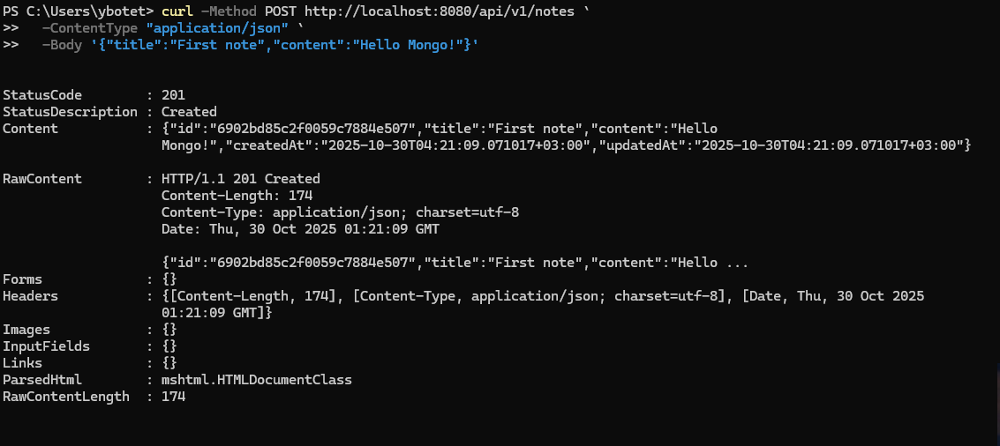
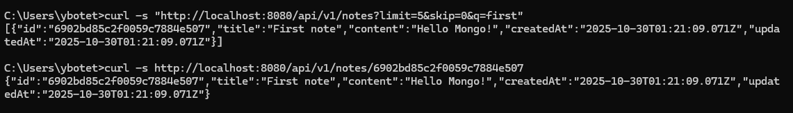

# Практическое занятие №8 - Работа с MongoDB в Go

## Описание
Этот проект демонстрирует работу с MongoDB — документно-ориентированной NoSQL базой данных. Реализован REST API для управления заметками с полным набором CRUD-операций, пагинацией и поиском.

## Цели
 - Понять базовые принципы документной БД MongoDB (документ, коллекция, BSON, ObjectID)
 - Научиться подключаться к MongoDB из Go с использованием официального драйвера
 - Создать коллекцию, индексы и реализовать CRUD для сущности заметок
 - Отработать фильтрацию, пагинацию, обновления, удаление и обработку ошибок

## Архитектура проекта


## Установка и старт
1. Предварительные требования
- **Go** версии 1.21 или выше  
- **Docker** и **Docker Compose**  
- **curl**, **Postman** или аналог для тестирования API

2. Настройка проекта
```go
# Клонирование и настройка
mkdir pz8-mongo && cd pz8-mongo

# Инициализация Go модуля
go mod init example.com/pz8-mongo

# Установка зависимостей
go get github.com/go-chi/chi/v5
go get go.mongodb.org/mongo-driver/mongo
go get go.mongodb.org/mongo-driver/bson

# Настройка переменных окружения
cp .env.example .env
```

3. Запуск MongoDB через Docker
```go
# Запуск MongoDB
docker compose up -d

# Проверка работы MongoDB
docker compose ps
```

4. Запуск приложения
```bash
# Запуск API сервера
go run ./cmd/api
```


скриншоты
 
 


1. Чем документная модель MongoDB принципиально отличается от реляционной? Когда она удобнее?
MongoDB хранит данные как гибкие документы (BSON/JSON) без строгой схемы, в отличие от таблиц с фиксированными столбцами в реляционных БД. Удобна при динамической структуре данных, вложенных объектах и горизонтальном масштабировании. 
 

2. Что такое ObjectID и зачем нужен _id? Как корректно парсить/валидировать его в Go?
_id — уникальный идентификатор документа. ObjectID — 12-байтный идентификатор, содержащий время создания. В Go парсится через primitive.ObjectIDFromHex(), а при ошибке — возвращается 404. 
 

3. Какие операции CRUD предоставляет драйвер MongoDB и какие операторы обновления вы знаете?
Операции: InsertOne, FindOne, UpdateOne, DeleteOne.
Операторы обновления: $set, $unset, $inc, $push, $pull. 
 

4. Как устроены индексы в MongoDB? Как создать уникальный индекс и чем он грозит при вставке?
Индексы ускоряют поиск. Уникальный индекс создаётся с опцией { unique: true }. При вставке дубликата — ошибка duplicate key, в API возвращается HTTP 409. 
 

5. Почему важно использовать context.WithTimeout при вызовах к базе? Что произойдёт при его срабатывании?

Чтобы избежать зависаний при сетевых ошибках. При таймауте операция отменяется, возвращается ошибка context.DeadlineExceeded, и сервер отвечает 500/504. 
